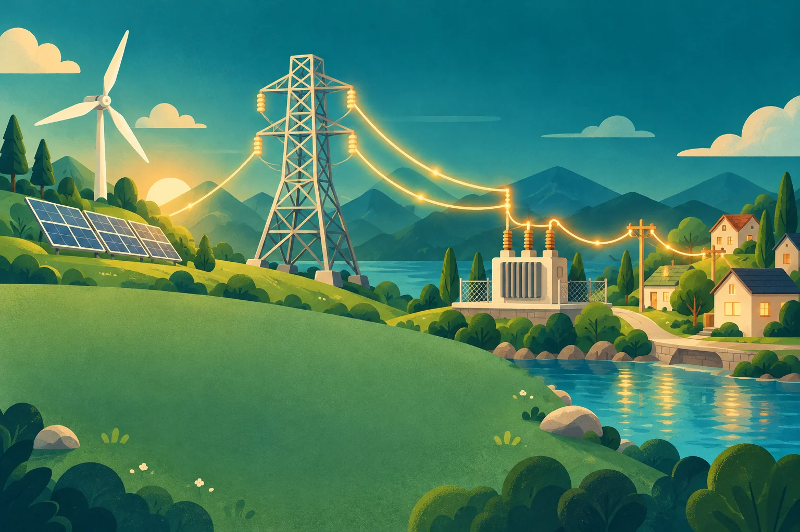
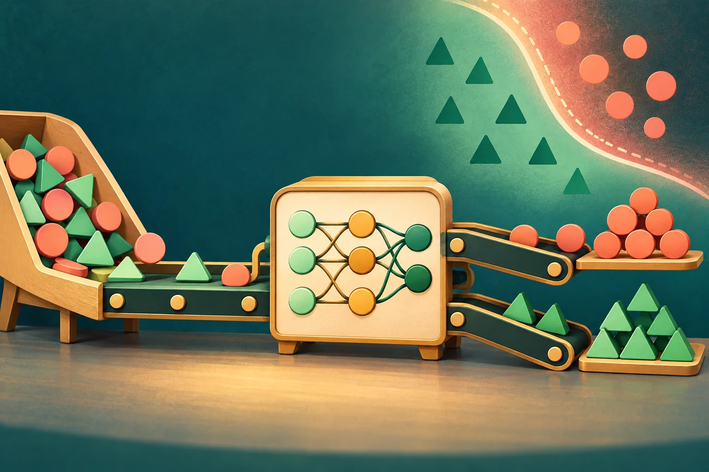

::: {.topic-home}
::: {.topic-intro}
<p class="topic-kicker">Math to Code</p>

# Choose a topic. Explore the ideas.

Mathematical lessons paired with executable code, organized into three fields.
:::

```{=html}
<nav class="topic-grid" aria-label="Math to Code topics">
  <a class="topic-card topic-card--power" href="lessons/power-engineering/" aria-label="Explore Power Engineering lessons">
    
    <span class="topic-card__shade" aria-hidden="true"></span>
    <span class="topic-card__content">
      <span class="topic-card__title">Power Engineering</span>
      <span class="topic-card__description">Optimization, power flow and state estimation.</span>
      <span class="topic-card__arrow" aria-hidden="true">&#8599;</span>
    </span>
  </a>

  <a class="topic-card topic-card--statistics" href="lessons/probability-statistics/" aria-label="Explore Probability and Statistics lessons">
    
    <span class="topic-card__shade" aria-hidden="true"></span>
    <span class="topic-card__content">
      <span class="topic-card__title">Probability &amp; Statistics</span>
      <span class="topic-card__description">Probability, data exploration and advanced statistical models.</span>
      <span class="topic-card__arrow" aria-hidden="true">&#8599;</span>
    </span>
  </a>

  <a class="topic-card topic-card--learning" href="lessons/machine-learning/" aria-label="Explore Machine Learning lessons">
    
    <span class="topic-card__shade" aria-hidden="true"></span>
    <span class="topic-card__content">
      <span class="topic-card__title">Machine Learning</span>
      <span class="topic-card__description">Support vector machines and classical–quantum kernels.</span>
      <span class="topic-card__arrow" aria-hidden="true">&#8599;</span>
    </span>
  </a>
</nav>
```
:::
